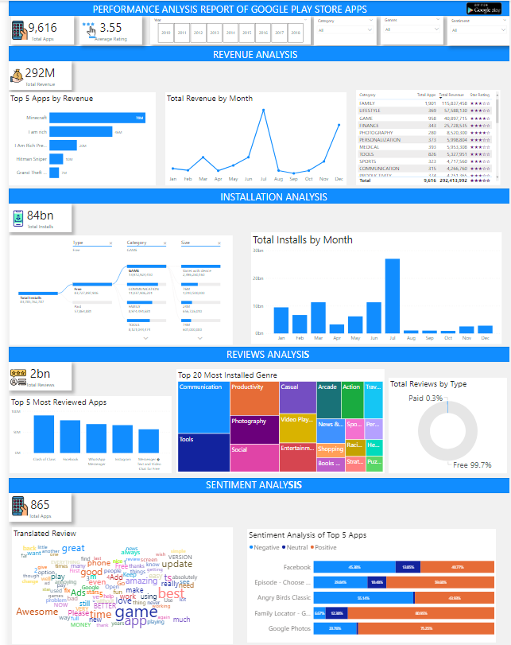
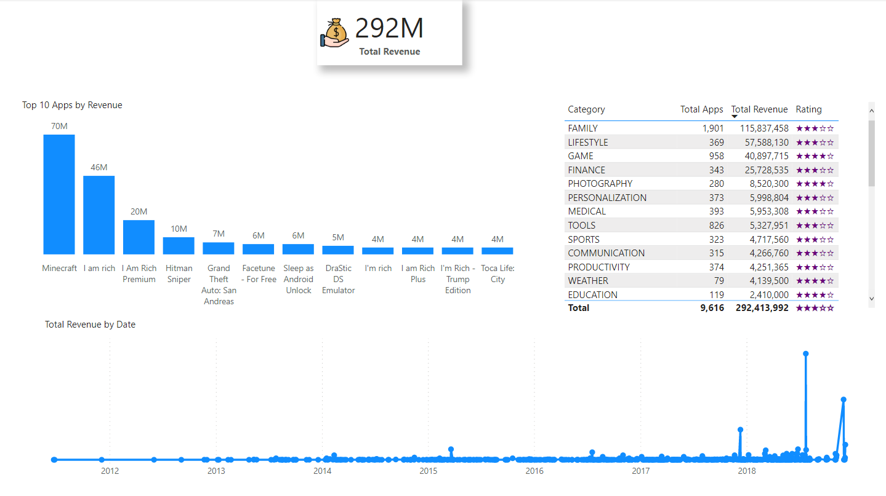
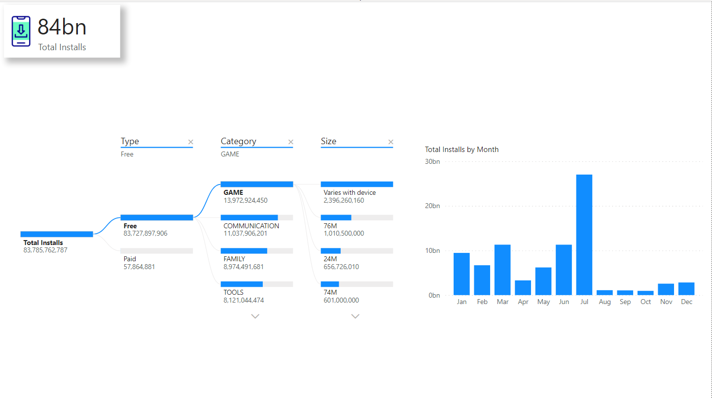
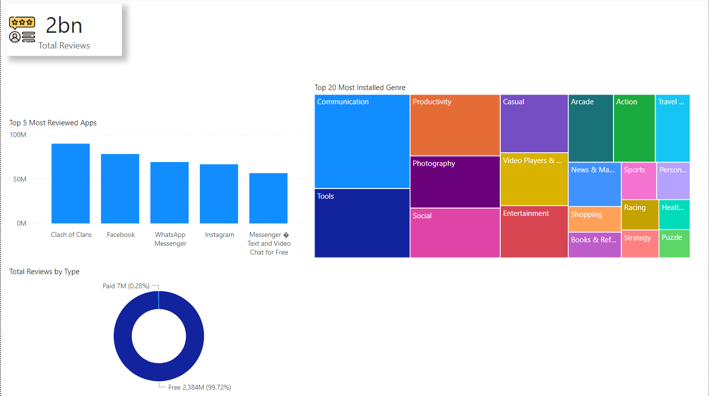
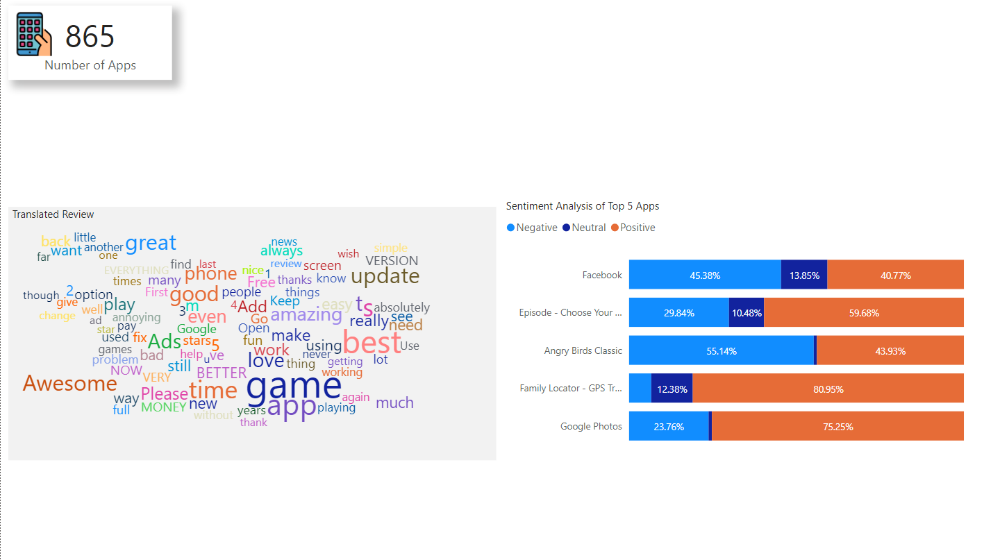

# GOOGLE-PLAYSTORE-APPS-ANALYSIS--SQL
## GOOGLE PLAYSTORE APPS ANALYSIS 
.png) 

### INTRODUCTION 
An analysis and visualization of google play store apps scraped data for the period of 2010 - 2018 . This project aims at cleaning the dataset, analyzing the given dataset, and deriving useful insights. This project also involves visualizing the data to better and easily understand trends and different categories.

### PROJECT OVERVIEW 
This project sought understand how a real-world database is analyzed using SQL, how to get maximum available insights from the dataset, how a structured query language helps us retrieve useful information from the database, and visualize the data with the power bi tool. 
### RESEARCH QUESTIONS
The project was guided by the following questions

1. Which apps have the highest rating in the given available dataset?

2. What are the number of installs and reviews for the above apps? Return the apps with the highest reviews to the top.

3. Which app has the highest number of reviews? Also, mention the number of reviews and category of the app

4. What is the total amount of revenue generated by the google play store by hosting apps? (Whenever a user buys apps from the google play store, the amount is considered in the revenue)

5. Which Category of google play store apps has the highest number of installs? also, find out the total number of installs for that particular category.

6. Which Genre has the most number of published apps?

7. Provide the list of all games ordered in such a way that the game that has the highest number of installs is displayed on the top (to avoid duplicate results use distinct)

8. Provide the list of apps that can work on android version 4.0.3 and UP.

9. How many apps from the given data set are free? Also, provide the number of paid apps.

10. Which is the best dating app? (Best dating app is the one having the highest number of Reviews)

11. Get the number of reviews having positive sentiment and number of reviews having negative sentiment for the app 10 best foods for you and compare them.

12. Which comments of ASUS SuperNote have sentiment polarity and sentiment subjectivity both as 1?

13. Get all the neutral sentiment reviews for the app Abs Training-Burn belly fat

14. Extract all negative sentiment reviews for Adobe Acrobat Reader with their sentiment polarity and sentiment subjectivity

### SOLUTIONS 
The following queries were written in mysql workbench to generate solutions.

CREATE DATABASE playstore; 
USE playstore; 
SHOW TABLES;
DESCRIBE playstore_review ;
DESCRIBE project_data; 
SELECT * FROM project_data ; 
SELECT * FROM playstore_review;
SELECT `last updated`, STR_TO_DATE(`Last Updated`, '%d-%m-%Y')  from project_data;
UPDATE PROJECT_DATA  
SET LAST_UPDATED = STR_TO_DATE(`Last Updated`, '%d-%m-%Y'); 
SELECT * FROM playstore_review;
ALTER TABLE project_data 
ADD COLUMN last_updated date ; 

ALTER TABLE project_data
DROP COLUMN `last updated`;
ALTER TABLE PROJECT_DATA
RENAME COLUMN `Current Ver` TO current_version ; 

ALTER TABLE PROJECT_DATA
RENAME COLUMN `Content Rating` TO content_rating ; 

ALTER TABLE PROJECT_DATA
RENAME COLUMN `Android ver` TO android_version ;

SHOW VARIABLES LIKE "sql_safe_updates";
SET SQL_SAFE_UPDATES = 0; 

-- solutions to questions 
-- Q1 APPS WITH HIGHEST RATING
SELECT app, rating FROM project_data 
WHERE rating = (SELECT  max(rating) FROM project_data); 

SELECT DISTINCT count(app) FROM project_data 
WHERE rating = (SELECT  max(rating) FROM project_data); 

-- Q2 NUMBER OF INSTALLS AND REVIEWS FOR ABOVE APPS 
SELECT app, rating, installs, reviews FROM project_data 
WHERE rating = (SELECT max(rating) FROM project_data)
ORDER BY reviews DESC; 

-- Q3 APP WITH HIGHEST NUMBER OF REVIEWS AND CATEGORY 
 SELECT app, category, reviews FROM project_data
 WHERE reviews = (SELECT max(reviews) FROM project_data)
 ORDER BY reviews DESC;
 
 -- Q4 TOTAL REVENUE BY APPS
 SELECT SUM(price*installs)  AS total_amount FROM Project_data; 
 
 -- Q5 CATEGORY OF APP WITH HIGHEST INSTALLS AND TOTAL INSTALLS FOR THAT CATEGORY 
SELECT category, SUM(installs) AS total_installs FROM Project_data
GROUP BY category
ORDER BY total_installs DESC
LIMIT 1;

-- Q6 WHICH GENRE HAS HIGHEST NUMBER OF APPS
SELECT genres, count(distinct app) AS APPS FROM project_data
GROUP BY genres 
ORDER BY APPS DESC;

-- Q7 LIST OF GAMES ORDERED BY HIGHEST INSTALLS 
SELECT app, category, sum(installs) AS installation FROM project_data
WHERE category = "game" 
GROUP BY app, category
ORDER BY installation desc;

-- Q8 APPS THAT WORK ON ANDROID 4.03 AND UP
SELECT app, android_version FROM project_data
WHERE android_version = "4.0.3 and up";  

-- Q9 TOTAL NUMBER OF FREE AND PAID APPS 
SELECT type, count(distinct app) AS APPS FROM project_data
GROUP BY type;  

-- Q10 BEST DATING APP BASED ON REVIEWS 
SELECT app, category, sum(reviews) FROM project_data
WHERE category = "dating"
GROUP BY app, category
ORDER BY sum(reviews) DESC
LIMIT 1;   

-- Q11 POSITIVE AND NEGATIVE SENTIMENTS FROM TEN BEST FOOD APPS  
SELECT app, sentiment, count(sentiment) AS feedbacks FROM playstore_review
WHERE app = "10 best foods for you" AND sentiment in ("positive","negative")
GROUP BY app, sentiment;

-- Q12 ASUS SUPERNOTE COMMENT WITH SENTIMENT SUBJECT AND POLARITY AS 1 
SELECT app, Translated_Review, Sentiment_Polarity, Sentiment_Subjectivity FROM playstore_review
WHERE app = "ASUS SUPERNOTE"  AND Sentiment_Polarity = 1 AND Sentiment_Subjectivity = 1; 

-- Q13 neutral sentiment reviews for the app Abs Training-Burn belly fat 
SELECT app, translated_review, sentiment FROM playstore_review
WHERE app = "Abs Training-Burn belly fat" AND sentiment = "neutral";

-- Q14 negative sentiment reviews for Adobe Acrobat Reader with their sentiment polarity and sentiment subjectivity
SELECT app, Translated_Review, Sentiment, Sentiment_Subjectivity, Sentiment_Polarity FROM playstore_review
WHERE app = "Adobe Acrobat Reader"  AND Sentiment = "neutral";

### ANALYSIS AND VISUALIZATIONS
#### REPORT
This PowerBI report tells an insighful story on google playystore apps performance, drawing from key metrics.

#### REVENUE ANALYSIS
 

>Google play store apps generated a total revenue of $292 million between 2010-2018.
>Revenue generation was very low until December 2017 where there was an appreciable increase in revenue and peaked in July 2018.
>In terms of category of apps, apps in the Family category generated the most revenue followed by Lifestyle, Game, Finance and Photography.
>These are the top 5 revenue-generating apps: Minecraft, I am rich, I Am Rich Premium, Hitman Sniper and Grand Theft Auto: San Andreas

#### INSTALLATION ANALYSIS

>A total of about 84 billion installations were made within the period
>Most installions were made in the month of July
>About 99% of installations were free apps in the Game, Communication, Family and Tools Category
>Installation of paid apps were mostly in the Family, Game, Personalization and Photography Category 

#### REVIEWS ANALYSIS
 

>A total of about 2 billion reviews were counted
>These are the top 5 most reviewed apps: Clash of Clans, Facebook, WhatsApp Messenger, Instagram and Messenger Text and Video Chat for Free
>These are the top 5 most reviewed genres: Communication, Tools, Productivity, Photography and Social

#### SENTIMENTS ANALYSIS 
 

>Sentiments of 865 Apps were collated
>Negative sentiments represnted 32.91%, Neutral 31.19% and Positive 35.9% of total count of sentiments
>Words used mostly include: game, awesome, best, Update, better, amazing, great etc
>Among the top 5 Apps by sentiment count, Facebook and Angry Birds Classic received more Negative sentiments than positives while Google Photos and Family Locator - GPS Tracker had more Positive sentiments than negatives

### THANK YOU

